# BitPerfect — Technical Documentation
## Epic: USB CD Ripping & Bit-Perfect DAC Playback

> **Version:** 2.0 · **Last Updated:** April 2026
> **Repo:** [github.com/steve-keep/BitPerfect](https://github.com/steve-keep/BitPerfect)
> **Stack:** Kotlin · Jetpack Compose · Material Design 3 · C++ (NDK/JNI)
> **License:** MIT · **Min SDK:** Android 7.0 (API 24) · **Target SDK:** Android 14+ (API 34+)

---

## Table of Contents

1. [Overview & Scope](#1-overview--scope)
2. [Target Users](#2-target-users)
3. [System Architecture](#3-system-architecture)
4. [Module Breakdown](#4-module-breakdown)
5. [CD Audio Fundamentals (Red Book)](#5-cd-audio-fundamentals-red-book)
6. [Epic 1 — Secure USB CD Ripping](#6-epic-1--secure-usb-cd-ripping)
   - 6.1 USB Host & Drive Detection
   - 6.2 Drive Diagnostics Dashboard
   - 6.3 SCSI/MMC Command Layer (C++ / JNI)
   - 6.4 Drive Offset Detection & Correction
   - 6.5 Secure Extraction Engine (EAC Methodology)
   - 6.6 Gap Detection
   - 6.7 Track Synchronisation
   - 6.8 AccurateRip Verification (v1 & v2)
   - 6.9 CUETools DB (CTDB) Secondary Verification
   - 6.10 Test & Copy Local CRC32 Verification
   - 6.11 Output: FLAC Encoding, Metadata & Log
7. [Epic 2 — Bit-Perfect USB DAC Playback](#7-epic-2--bit-perfect-usb-dac-playback)
   - 7.1 Scope Note (PRD)
   - 7.2 Android Audio Stack & Why It Must Be Bypassed
   - 7.3 Two Bypass Strategies
   - 7.4 Recommended Approach: Android 14 AudioMixerAttributes
   - 7.5 Fallback: Direct USB Isochronous (libusb / NDK)
   - 7.6 DAC Detection & Capability Negotiation
   - 7.7 44/45 Sample Scheduling for 44.1 kHz
   - 7.8 Playback Pipeline & State Machine
8. [Data Flow Diagrams](#8-data-flow-diagrams)
9. [Key Interfaces & Kotlin APIs](#9-key-interfaces--kotlin-apis)
10. [Permissions & Hardware Requirements](#10-permissions--hardware-requirements)
11. [Error Handling & Edge Cases](#11-error-handling--edge-cases)
12. [Testing Strategy](#12-testing-strategy)
13. [Feature Parity Matrix (EAC vs BitPerfect)](#13-feature-parity-matrix-eac-vs-bitperfect)
14. [Performance Considerations](#14-performance-considerations)
15. [Appendix A — SCSI MMC Command Reference](#appendix-a--scsi-mmc-command-reference)
16. [Appendix B — AccurateRip URL Format](#appendix-b--accuraterip-url-format)
17. [Appendix C — EAC-Compatible Log Format](#appendix-c--eac-compatible-log-format)
18. [Appendix D — Dependency Reference](#appendix-d--dependency-reference)

---

## 1. Overview & Scope

BitPerfect is an open-source, forensic-grade audio CD extraction utility for Android. It provides a mobile alternative to desktop tools like Exact Audio Copy (EAC) or Whipper, focused on data integrity, hardware-level diagnostics, and bit-perfect verification.

This document covers two epics:

**Epic 1 — Secure USB CD Ripping** is the primary and current focus. BitPerfect extracts raw PCM audio from a physical CD via a USB CD drive connected over OTG, using the full EAC methodology: multi-pass secure reads, cache defeat, AccurateRip verification, drive offset correction, and EAC-compatible log files.

**Epic 2 — Bit-Perfect USB DAC Playback** covers future playback of ripped FLAC files through a USB DAC at 44.1 kHz / 16-bit with zero resampling or mixing.

> **Important — PRD Scope Note:** `prd.md` (Section 6) **explicitly excludes a built-in music player** from v1.0: *"No Playback: Explicitly excludes a music player to keep the app focused and lightweight."* Epic 2 is a **future-phase feature**. Epic 1 is the current development priority.

### Non-Goals (v1.0)
- Streaming from network sources.
- Sample rate conversion or DSP processing of any kind.
- Formats other than FLAC as primary output.
- Playback (deferred — see Epic 2 pre-specification).

---

## 2. Target Users

- **Audiophiles** — Digitising CD collections without a desktop computer.
- **Archivists** — Requiring a verifiable, tamper-evident log proving the integrity of the digital copy.
- **Technical Users** — Wanting to understand hardware limitations (C2 pointer support, cache behaviour, drive read offset).

---

## 3. System Architecture

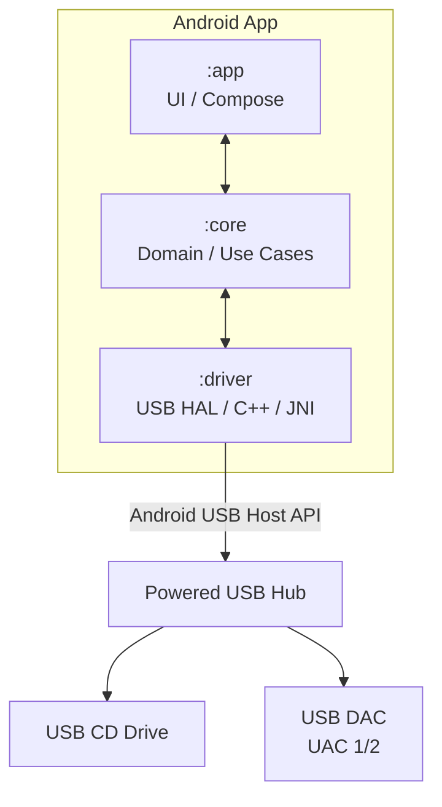

The three Gradle modules map to clean-architecture layers:

| Module | Role |
|--------|------|
| `:app` | Jetpack Compose UI, navigation, ViewModels (Material Design 3 / Material You) |
| `:core` | Domain models, use-case orchestration, FLAC encoding, AccurateRip verification, rip log generation |
| `:driver` | Low-level USB communication — SCSI/MMC bulk transport for CD-ROM, UAC isochronous for DAC (C++/JNI via libusb) |

---

## 4. Module Breakdown

### `:driver` — USB Hardware Abstraction

Contains all native C++ code and Kotlin JNI bindings. Owns:

- `UsbCdDriver` — SCSI MMC command dispatch over USB Bulk-Only Transport (BOT).
- `UsbAudioDriver` — UAC isochronous write pipeline (Epic 2).
- `DriveCapabilities` — result of drive feature detection (Accurate Stream, C2, cache, offset).
- CMake build configuration.

**libusb vs libusbhost decision (resolved):** The PRD specifies `libusb` (via Android NDK) as the native USB library. `libusbhost` (bundled in AOSP) lacks reliable isochronous transfer support — critical for Epic 2 DAC playback. For Epic 1 bulk transfers either library works, but standardising on libusb across both epics avoids a future migration.

### `:core` — Business Logic

- `RipUseCase` — orchestrates sector reads, retry/majority-vote logic, offset correction, verification, FLAC encoding, and log generation. Runs in a `Foreground Service` with Kotlin Coroutines.
- `AccurateRipVerifier` — disc ID calculation, ARv1/v2 checksum computation, HTTP database query.
- `CtdbVerifier` — CUETools DB whole-disc checksum and query.
- `FlacEncoder` / `FlacDecoder` — wrappers around libFLAC (JNI).
- `MetadataFetcher` — MusicBrainz and freedb/gnudb lookups by disc ID.
- `RipLogger` — produces EAC-compatible `rip_log.txt` with SHA-256 signature.
- `MusicStorage` — MediaStore / Scoped Storage abstraction for writing output files.

### `:app` — UI Layer

- `DiagnosticsScreen` — pre-rip view: drive model, C2 support, cache detection, offset. Required by PRD §3.1.
- `RipScreen` — track list, per-track progress, re-read counters, quality %, verification badges.
- `TerminalView` — scrollable real-time log of SCSI command feedback. Required by PRD §6.
- `LibraryScreen` — browsable FLAC library from scoped storage.
- `PlayerScreen` — transport controls (Epic 2, future phase).
- `UsbStatusBar` — persistent indicator of connected drive/DAC state.

---

## 5. CD Audio Fundamentals (Red Book)

Understanding the physical format is essential context for every algorithm in the ripping pipeline.

### Disc Parameters (IEC 60908)

| Parameter | Value |
|-----------|-------|
| Sampling rate | 44,100 Hz |
| Bit depth | 16-bit signed (two's complement) |
| Channels | 2 (stereo, interleaved L/R) |
| Bitrate | 1,411.2 kbit/s raw PCM |
| Sector size (DAE) | 2,352 bytes |
| Sectors per second | 75 |
| Samples per sector | 588 stereo pairs (1,176 individual 16-bit samples) |
| Max tracks | 99 |

### Sector Anatomy

Each sector contains 98 channel-data frames, each carrying 24 bytes of audio plus 8 bytes of CIRC parity and 1 byte of subchannel data:

```
98 frames × 24 bytes audio  = 2,352 bytes of audio per sector
98 frames × 1 byte subchan  =    98 bytes of subchannel per sector
```

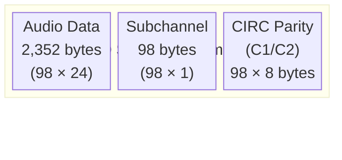

### CIRC Error Correction

Audio data is interleaved across many sectors so a physical scratch destroys small fragments of many sectors rather than large chunks of a few. The two-layer CIRC (C1/C2) corrects most errors. If both fail, the drive either returns silently corrupted data or — if supported — signals the failure via C2 error pointers. Unlike CD players, CD-ROM drives do **not** perform interpolation/concealment; they return raw data or zeros.

### Subchannel Data

The 98 subchannel bytes per sector are organised into 8 sub-channels (P through W):

- **Q subchannel**: Timecode (MSF), track number, index. Used for gap detection, TOC construction, seeking.
- **P subchannel**: Simple pause/gap flag.
- **R–W subchannels**: CD+G karaoke (rarely relevant for audio ripping).

### Table of Contents (TOC)

Stored in the lead-in area. Maps each track number to a start LBA using MSF timecodes, exposed via `READ TOC` (0x43). The TOC only stores `index 01` (music start) positions; gaps and hidden tracks must be detected by reading Q subchannel data directly.

---

## 6. Epic 1 — Secure USB CD Ripping

### 6.1 USB Host & Drive Detection

Android's `UsbManager` enumerates connected USB devices. BitPerfect registers a `BroadcastReceiver` for attach/detach events.

```kotlin
// :driver — UsbDeviceMonitor.kt
val filter = IntentFilter(UsbManager.ACTION_USB_DEVICE_ATTACHED).apply {
    addAction(UsbManager.ACTION_USB_DEVICE_DETACHED)
    addAction(ACTION_USB_PERMISSION)
}
context.registerReceiver(usbReceiver, filter)
```

A device is classified as a CD-ROM drive when its USB interface reports:
- Device Class `0x08` (Mass Storage)
- SubClass `0x02` or `0x06` (SCSI Transparent Command Set)

This is confirmed by issuing an `INQUIRY` (0x12) command and verifying `Peripheral Device Type = 0x05` (CD-ROM) in the response.

**Permission flow:**

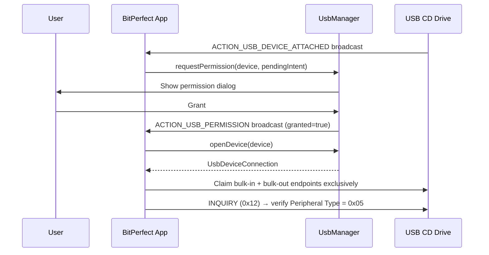

> **Hardware requirement:** Most USB CD drives draw more than 500 mA, exceeding the OTG power budget. A **powered USB hub** is required. The DiagnosticsScreen should display a warning if power negotiation indicates the drive may be underpowered.

**Android 15 note:** Android 15 tightened USB device access policy. No privileged `MANAGE_USB` permission is needed — standard `UsbManager.requestPermission()` is fully compliant. The permission dialog must be presented before any data transfer begins.

### 6.2 Drive Diagnostics Dashboard

Required by PRD §3.1. Performed once per drive model; results cached.

```kotlin
data class DriveCapabilities(
    val vendorString: String,
    val modelString: String,
    val firmwareRevision: String,
    val supportsAccurateStream: Boolean,     // GET CONFIGURATION feature 0x0107
    val supportsC2ErrorPointers: Boolean,    // GET CONFIGURATION feature 0x0014
    val c2IsReliable: Boolean,               // Confirmed by reliability test (§6.2)
    val cacheDetected: Boolean,
    val estimatedCacheSizeSectors: Int,      // 0 if no cache
    val supportedReadCommands: List<ReadCommand>,
    val maxDaeSpeedX: Int,
    val readOffset: Int?                     // null until calibrated
)
```

**Detection procedure:**

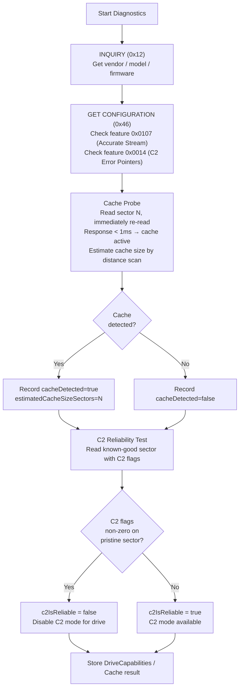

> **C2 reliability note (from `secure.md`):** EAC documentation explicitly recommends not trusting C2 on most drives. Some drives report false positives; others miss real errors. BitPerfect defaults to C2 **disabled** and only enables it after a per-drive reliability test passes.

### 6.3 SCSI/MMC Command Layer (C++ / JNI)

Raw sector reads require SCSI MMC commands over USB Bulk-Only Transport (BOT). This cannot be done from Kotlin alone — Android's block layer does not expose SCSI passthrough to apps.

**USB BOT Transaction Structure:**

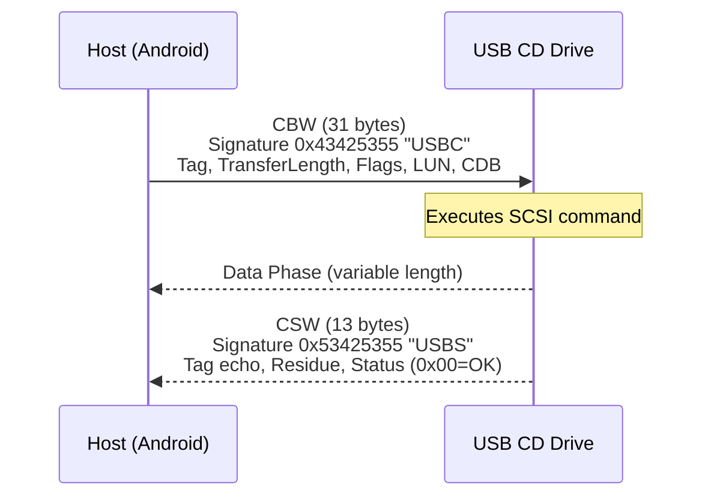

**Primary Audio Read: READ CD (0xBE)**

```
CDB (12 bytes):
  [0]  0xBE          READ CD opcode
  [1]  0x00          Expected sector type (0=any)
  [2]  LBA[31:24]    Starting LBA (big-endian)
  [3]  LBA[23:16]
  [4]  LBA[15:8]
  [5]  LBA[7:0]
  [6]  Length[23:16] Transfer length in sectors
  [7]  Length[15:8]
  [8]  Length[7:0]
  [9]  0xF8          Sync=1, all headers, user data, EDC/ECC, no C2
                     Use 0xF9 for C2 error pointers
  [10] 0x00          Subchannel: 0x00=none, 0x01=raw 96-byte P-W, 0x02=Q only
  [11] 0x00          Reserved
```

**Response per sector:**
- `0xF8`, no subchannel → **2,352 bytes** raw audio PCM
- `0xF9` (C2 enabled) → 2,352 + 294 bytes C2 flags = 2,646 bytes
- Subchannel `0x01` → 2,352 + 96 bytes subchannel = 2,448 bytes

**JNI Bridge:**

```kotlin
// :driver — CdRomJni.kt
object CdRomJni {
    init { System.loadLibrary("bitperfect_driver") }

    external fun openDevice(fd: Int): Long
    external fun inquire(handle: Long): DriveInfoNative
    external fun getConfiguration(handle: Long): DriveFeatureNative
    external fun readToc(handle: Long): TrackTocNative
    external fun readSector(handle: Long, lba: Int, withC2: Boolean): ByteArray?
    external fun readSubchannel(handle: Long, lba: Int): ByteArray?   // 98 bytes Q data
    external fun setDriveSpeed(handle: Long, speedKBps: Int): Boolean
    external fun closeDevice(handle: Long)
}
```

**C++ core (simplified):**

```cpp
// driver/src/main/cpp/usb_cd_driver.cpp
bool read_sector(libusb_device_handle* handle, int lba,
                 bool with_c2, uint8_t* out_buf) {
    uint8_t cdb[12] = {
        0xBE, 0x00,
        (uint8_t)(lba >> 24), (uint8_t)(lba >> 16),
        (uint8_t)(lba >> 8),  (uint8_t)(lba),
        0x00, 0x00, 0x01,
        (uint8_t)(with_c2 ? 0xF9 : 0xF8),
        0x00, 0x00
    };
    size_t expected = with_c2 ? 2646 : 2352;
    return bot_transfer(handle, cdb, 12, out_buf, expected);
}
```

### 6.4 Drive Offset Detection & Correction

Every CD-ROM drive has a fixed **read sample offset** — a constant number of samples by which all reads are shifted relative to the disc master. Without correction, rips from different drives of the same disc produce different files and fail AccurateRip cross-verification.

Offsets are measured in **samples** (1 sample = 4 bytes: 2 bytes × 2 channels). The reference Plextor 14/32 drive measures at +679 samples. All other drives are calibrated relative to this.

```
Positive offset (+N): drive reads N samples late.
  → N samples missing at end of disc; N samples from prior track bleed into start.

Negative offset (-N): drive reads N samples early.
  → N extra samples appear at start; N samples missing at end.
```

**Method 1 — AccurateRip Auto-Calibration (preferred):**

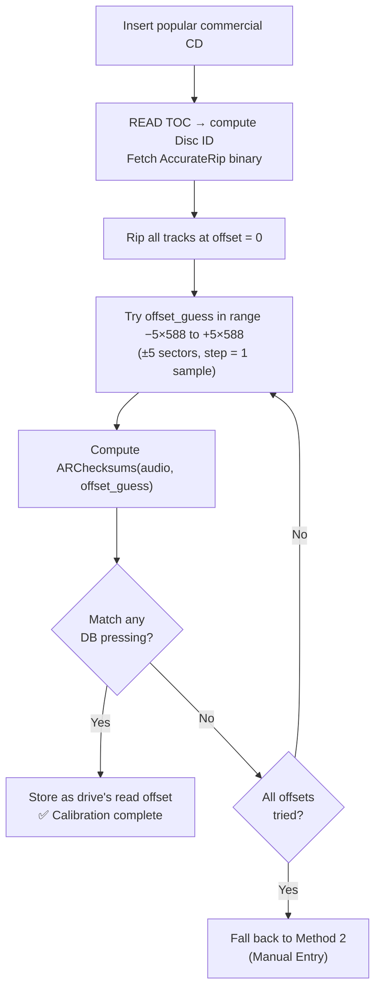

**Method 2 — Manual Entry:** Display the model string from `INQUIRY`; link to accuraterip.com/driveoffsets.asp; allow user to enter a known value.

**Applying the offset during extraction:**

```
If drive offset = +N samples:
  start_lba = track_start_lba - ceil(N / 588)
  // Discard the leading N-sample prefix after reading.
  // For track 1: overread into lead-in if supported; otherwise prepend silence.

If drive offset = -N samples:
  start_lba = track_start_lba + floor(N / 588)
  // Prepend N samples of silence.
  // For last track: overread into lead-out if supported; otherwise append silence.
```

### 6.5 Secure Extraction Engine (EAC Methodology)

This is the core ripping algorithm, directly implementing EAC "Secure Mode" as documented in `secure.md`.

#### Why Secure Mode Is Necessary

- **Jitter:** CD-ROM drives cannot guarantee exact sector positioning. Typical jitter is ±1–5 sectors (±588–2,940 samples); extreme cases can reach ±14,000+ samples. Without correction, adjacent sectors have gaps or overlaps, producing audible clicks.
- **Caching:** Drives cache audio data. Re-reading the same sector without cache-busting always returns the cached copy — even if the original read was wrong — defeating simple "read twice and compare".

#### Algorithm: Multi-Pass Majority Vote

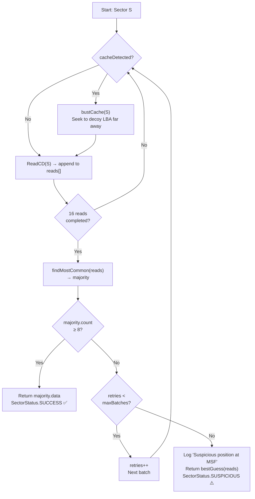

| Setting | Max batches | Max reads/sector |
|---------|-------------|-----------------|
| Low | 1 | 16 |
| Medium | 3 | 48 |
| High | 5 | 82 (80 re-reads + initial) |

**Track Quality Metric:**
```
Quality % = (minimum_reads_needed / actual_reads_performed) × 100
```
100% means no re-reads were needed. Only "suspicious positions" (no 8-of-16 majority after all batches) represent truly unrecoverable errors.

#### Cache-Busting

```kotlin
fun bustCache(targetLba: Int) {
    val decoyLba = (targetLba + 10_000).coerceAtMost(totalSectors - 1)
    driver.readSector(decoyLba)   // Force drive cache to fill with distant data
}
```

Cache-busting seeks are why secure mode on caching drives runs at roughly ¼ of rated DAE speed.

#### Accurate Stream vs. Overlapping Read

- **Accurate Stream supported:** Sectors are read sequentially with guaranteed contiguous positioning. No jitter compensation is needed between reads.
- **Accurate Stream not supported:** BitPerfect uses overlapping reads (read sectors N−2 through N+2, find maximum correlation between end of one read and start of the next) to eliminate jitter gaps — equivalent to cdparanoia's paranoia mode on Linux.

#### C2 Error Pointer Mode (conditional)

Only enabled when `driveCapabilities.c2IsReliable == true`:

```
For each sector S:
  (data, c2_flags) = ReadCDWithC2(S)
  IF c2_flags == 0:
    RETURN data          // No errors reported — single read sufficient
  ELSE:
    RETURN SecureModeRead(S)   // Fall back to multi-pass for this sector only
```

This operates near burst speed for clean sectors; most drives fail the reliability test and this mode stays disabled.

#### Speed Reduction on Persistent Errors

```kotlin
// SET CD SPEED (0xBB)
fun setDriveSpeed(speedKBps: Int) {
    val cdb = byteArrayOf(0xBB.toByte(), 0,
        (speedKBps shr 8).toByte(), speedKBps.toByte(),
        0, 0, 0, 0, 0, 0, 0, 0)
    sendScsiCommand(cdb, null)
}
// 1×=176, 2×=352, 4×=705, 8×=1411 KB/s
// On persistent mismatch sectors: try 2× or 1×
```

#### Kotlin State Machine

```kotlin
enum class SectorStatus { SUCCESS, SUSPICIOUS, UNREADABLE }

data class SectorResult(
    val data: ByteArray,
    val status: SectorStatus,
    val readsPerformed: Int
)

suspend fun readSectorSecure(lba: Int): SectorResult {
    val maxBatches = settings.errorRecoveryQuality
    val allReads = mutableListOf<ByteArray>()

    for (batch in 0 until maxBatches) {
        val batchReads = mutableListOf<ByteArray>()
        repeat(16) {
            if (capabilities.cacheDetected) bustCache(lba)
            batchReads += driver.readSector(lba) ?: ByteArray(2352)
        }
        allReads += batchReads

        val majority = findMajority(batchReads)
        if (majority.count >= 8)
            return SectorResult(majority.data, SectorStatus.SUCCESS, allReads.size)
    }

    return SectorResult(findMostCommon(allReads), SectorStatus.SUSPICIOUS, allReads.size)
}
```

### 6.6 Gap Detection

The TOC only stores `index 01` (music start) positions. Pre-gaps — and hidden tracks before Track 1 — must be detected by reading Q subchannel data. BitPerfect implements all three EAC gap detection methods:

**Method A (fastest):** Binary-search `READ SUBCHANNEL` (0x42) commands to find the boundary between index 0 (gap) and index 1 (music start).

**Method B:** Linear scan of Q subchannel data from the previous track end to the current track start. Slower but more reliable on drives that return incorrect binary-search results.

**Method C (most accurate):** Full sector-by-sector scan of Q subchannel across the entire gap region. Used when Methods A and B return inconsistent results.

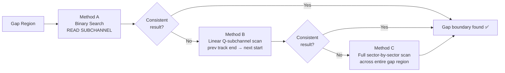

**Gap handling options in UI:**

| Option | Description |
|--------|-------------|
| Append to previous track | Default; preserves gapless playback when tracks are played sequentially |
| Prepend to next track | Gap silence placed at start of Track N+1 |
| Discard gaps | Drop entirely — safe only for studio albums with pure silence gaps |

### 6.7 Track Synchronisation

Required for live albums and gapless recordings. On drives without Accurate Stream, seeking to a new track position introduces jitter at track boundaries, creating an audible click.

**Solution (from `secure.md`):**

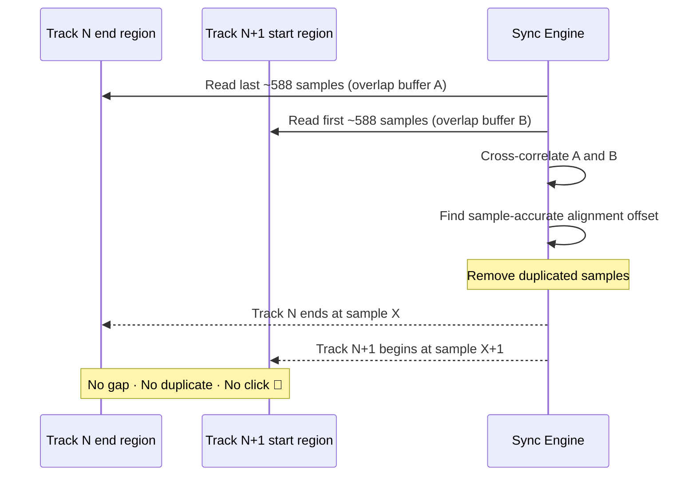

On drives with Accurate Stream, the drive maintains position across track reads automatically and synchronisation is unnecessary.

### 6.8 AccurateRip Verification (v1 & v2)

AccurateRip (accuraterip.com) is a crowdsourced checksum database. If rips from thousands of different drives produce the same checksum, the rip is almost certainly correct — it is statistically impossible for different drives to introduce identical errors at identical sample positions.

#### Disc ID Calculation

```cpp
// 3-part AccurateRip disc ID derived from the TOC
DWORD TrackOffsetsAdded      = 0;
DWORD TrackOffsetsMultiplied = 1;

for (int i = firstTrack; i <= lastTrack; i++) {
    DWORD lba = MSFtoLBA(tracks[i].address);
    TrackOffsetsAdded      += lba;
    TrackOffsetsMultiplied *= max(lba, 1u);
}
DWORD leadOutLBA = MSFtoLBA(leadOut.address);
TrackOffsetsAdded      += leadOutLBA;
TrackOffsetsMultiplied *= leadOutLBA;
DWORD freedbId = ComputeFreedbID(toc);

// disc_id_1 = TrackOffsetsAdded
// disc_id_2 = TrackOffsetsMultiplied
// disc_id_3 = freedbId
```

#### ARv1 Checksum Algorithm

Weighted 32-bit sum over audio samples, excluding the first 2,939 samples of Track 1 and the last 2,939 samples of the final track (boundary regions where drives struggle with exact positioning):

```kotlin
fun computeARv1(pcmBytes: ByteArray, trackNum: Int, totalTracks: Int): UInt {
    var checksum = 0u
    var multiplier = 1u
    val dwordCount = pcmBytes.size / 4

    val skipStart = if (trackNum == 1) (2352 * 5) / 4 else 0
    val skipEnd   = if (trackNum == totalTracks) dwordCount - (2352 * 5) / 4 else dwordCount

    for (i in 0 until dwordCount) {
        val sample = pcmBytes.getLeUInt32(i * 4)
        if (multiplier.toInt() in skipStart..skipEnd) {
            checksum += multiplier * sample
        }
        multiplier++
    }
    return checksum
}
```

> **Known ARv1 flaw (from `secure.md`):** Approximately 3% of audio data — certain right-channel samples in a 65,536-sample cycle — is not fully covered due to an implementation oversight. ARv2 corrects this.

#### ARv2 Checksum Algorithm

Uses 64-bit multiplication to capture the overflow that ARv1 missed:

```kotlin
fun computeARv2(pcmBytes: ByteArray): UInt {
    var checksum = 0u
    var mulBy = 1u
    val dwordCount = pcmBytes.size / 4

    for (i in 0 until dwordCount) {
        val value = pcmBytes.getLeUInt32(i * 4)
        val product = value.toULong() * mulBy.toULong()      // 64-bit
        checksum += (product and 0xFFFFFFFFuL).toUInt()      // low 32 bits
        checksum += (product shr 32).toUInt()                 // high 32 bits
        mulBy++
    }
    return checksum
}
```

#### Database Query

```
GET http://www.accuraterip.com/accuraterip/{a}/{b}/{c}/dAR{id1}-{id2}-{id3}.bin
```

Where `a`, `b`, `c` are the last 3 hex nibbles of `disc_id_1`. The binary response contains one record per pressing, each with per-track confidence and CRC values.

**Confidence interpretation:**

| Confidence | Meaning |
|-----------|---------|
| 0 | No submissions; cannot verify |
| 1–2 | Low — few submissions |
| 3–10 | Moderate — likely correct |
| 10+ | High — almost certainly correct |
| 200 | Maximum reported (200+ matching submissions) |

A non-match is **not** a rip failure — it may simply mean the pressing is not yet in the database. Only treat as a problem if confidence ≥ 3 and checksums differ.

### 6.9 CUETools DB (CTDB) Secondary Verification

CTDB provides independent second verification using a whole-disc checksum. Results are reported as X/Y (X matching submissions out of Y total). A 10/10 CTDB result alongside high-confidence AccurateRip is the gold standard for a verified rip. Query endpoint: `http://db.cuetools.net/`

### 6.10 Test & Copy Local CRC32 Verification

Fallback when AccurateRip is unavailable or the disc is not in the database. Two fully independent rip passes are performed:

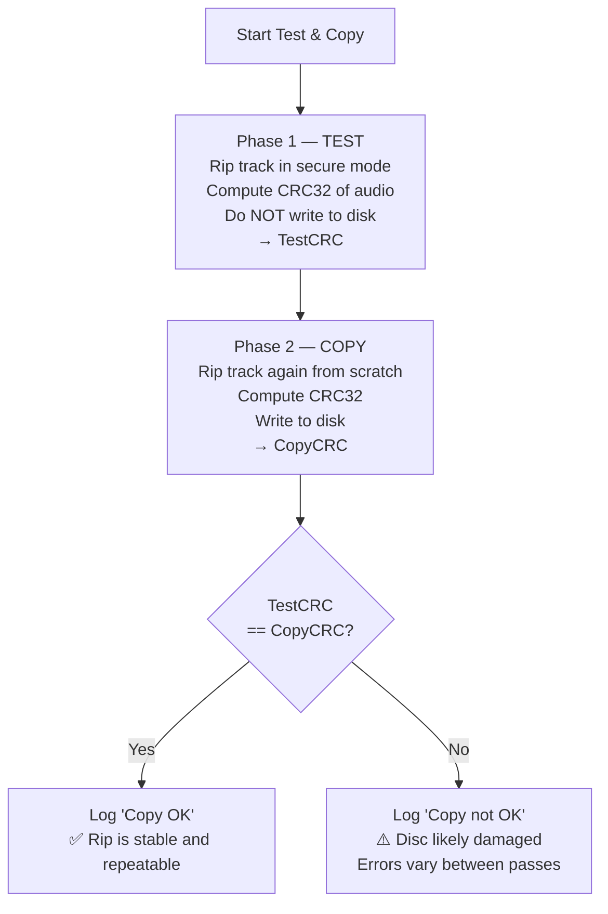

> **Limitation:** T&C confirms reproducibility, not ground-truth accuracy. A drive with a systematic offset or firmware bug would pass T&C but fail AccurateRip.

### 6.11 Output: FLAC Encoding, Metadata & Log

#### FLAC Encoding

- **Codec:** libFLAC via JNI.
- **Sample rate:** 44,100 Hz — never resampled.
- **Bit depth:** 16-bit signed integer.
- **Channels:** 2 (stereo, interleaved L/R).
- **Compression level:** 5 (balanced speed vs. file size).

#### File Storage (via MediaStore / Scoped Storage)

```
/Music/BitPerfect/[Artist]/[Album]/[NN] - [Title].flac
```

#### Vorbis Comment Tags

| Tag | Source |
|-----|--------|
| `TITLE` | MusicBrainz / freedb |
| `ARTIST` | MusicBrainz / freedb |
| `ALBUMARTIST` | MusicBrainz / freedb |
| `ALBUM` | MusicBrainz / freedb |
| `DATE` | MusicBrainz / freedb |
| `TRACKNUMBER` | TOC |
| `TOTALTRACKS` | TOC |
| `DISCNUMBER` | MusicBrainz |
| `MUSICBRAINZ_TRACKID` | MusicBrainz |
| `TRACKCRC` | CRC32 of raw PCM |
| `ACCURATERIP_V1` | Computed ARv1 checksum (hex) |
| `ACCURATERIP_V2` | Computed ARv2 checksum (hex) |
| `ACCURATERIPRESULT` | e.g. `"Rip accurate, confidence 14 [ARv2]"` |
| `ENCODER` | `BitPerfect-Android vX.Y` |

**Metadata priority order:** MusicBrainz (by DiscID) → freedb / GnuDB → manual user entry.

**freedb Disc ID:**

```cpp
DWORD ComputeFreedbID(ARTOC* toc) {
    int n = 0;
    for (int i = firstTrack; i <= lastTrack; i++) {
        int t = MSFtoSeconds(toc->Tracks[i].Address);
        while (t > 0) { n += (t % 10); t /= 10; }
    }
    int t = MSFtoSeconds(LeadOut) - MSFtoSeconds(Tracks[firstTrack]);
    return ((n % 0xFF) << 24) | (t << 8) | TrackCount;
}
```

#### CUE Sheet

Written alongside FLAC files for full disc archival. Preserves track timing and gap positions, compatible with tools like foobar2000 and EAC:

```cue
PERFORMER "Artist Name"
TITLE "Album Title"
FILE "Album Title.flac" WAVE
  TRACK 01 AUDIO
    TITLE "Track Title"
    INDEX 00 00:00:00
    INDEX 01 00:02:00
  TRACK 02 AUDIO
    TITLE "Track Title 2"
    INDEX 00 03:45:10
    INDEX 01 03:47:00
```

#### Rip Log (`rip_log.txt`)

EAC-compatible format. Required by PRD §5.2. Stored alongside audio files. A SHA-256 hash of the log content is appended to prevent tampering, compatible with CUETools log verifier. See Appendix C for full format.

---

## 7. Epic 2 — Bit-Perfect USB DAC Playback

> **Phase note:** Per `prd.md` §6, playback is excluded from v1.0. This is a forward-specification for a future phase. Architectural decisions in `:driver` and `:core` must not block its future addition.

### 7.1 Scope Note (PRD)

The PRD keeps BitPerfect focused as a ripping tool in v1.0. The playback epic is pre-specified here so that module interface design (particularly in `:driver`) accounts for it from the start.

### 7.2 Android Audio Stack & Why It Must Be Bypassed

Android's `AudioTrack` / `AudioFlinger` routes all audio through the system mixer, which:

- **Resamples** everything to the device's system sample rate — almost always 48 kHz on consumer Android hardware.
- **Mixes** with concurrent audio streams (notifications, system sounds).
- May apply system-level EQ or dynamic range compression depending on OEM Audio HAL configuration.

Any of these destroy bit-perfect accuracy for 44.1 kHz / 16-bit Red Book audio.

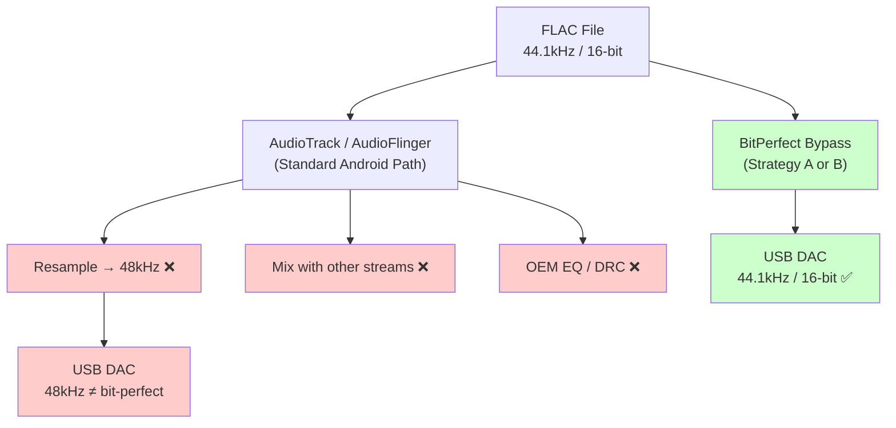

### 7.3 Two Bypass Strategies

#### Strategy A — Android 14 `AudioMixerAttributes` (API 34+)

Android 14 introduced `AudioMixerAttributes` with `MIXER_BEHAVIOR_BIT_PERFECT`. When configured, the framework sends audio data unmodified through the Audio HAL directly to the USB device — no mixing, no volume scaling, no resampling.

**Requirements:** The device OEM must have implemented the Audio HAL using the AIDL interface (not legacy HIDL), and added `AUDIO_OUTPUT_FLAG_BIT_PERFECT` to the dynamic mix port in `usb_audio_policy_configuration.xml`. This is **optional** for OEMs, so availability varies by device even on Android 14+.

#### Strategy B — Direct USB Isochronous (libusb / NDK)

Used by USB Audio Player PRO, HiBy Music, and others before Android 14. BitPerfect communicates directly with the USB DAC at the isochronous transfer level, completely bypassing the Android audio stack.

> ⚠️ **Root is NOT required.** `UsbManager.openDevice()` grants direct USB device access via standard runtime permissions. No kernel modifications are needed.

### 7.4 Recommended Approach: Android 14 AudioMixerAttributes

**Preferred on devices running Android 14+ with OEM HAL support.** Simpler to implement and leverages the platform correctly.

```kotlin
@RequiresApi(Build.VERSION_CODES.UPSIDE_DOWN_CAKE)  // API 34
fun configureBitPerfectPlayback(
    audioManager: AudioManager,
    usbDevice: AudioDeviceInfo
) {
    val targetFormat = AudioFormat.Builder()
        .setSampleRate(44100)
        .setEncoding(AudioFormat.ENCODING_PCM_16BIT)
        .setChannelMask(AudioFormat.CHANNEL_OUT_STEREO)
        .build()

    val bitPerfectAttribs = AudioMixerAttributes.Builder(targetFormat)
        .setMixerBehavior(AudioMixerAttributes.MIXER_BEHAVIOR_BIT_PERFECT)
        .build()

    audioManager.setPreferredMixerAttributes(
        AudioAttributes.Builder().setUsage(AudioAttributes.USAGE_MEDIA).build(),
        usbDevice,
        bitPerfectAttribs
    )
}

fun isBitPerfectApiSupported(
    audioManager: AudioManager,
    device: AudioDeviceInfo
): Boolean {
    if (Build.VERSION.SDK_INT < Build.VERSION_CODES.UPSIDE_DOWN_CAKE) return false
    return audioManager.getSupportedMixerAttributes(device)
        .any { it.mixerBehavior == AudioMixerAttributes.MIXER_BEHAVIOR_BIT_PERFECT }
}
```

If `isBitPerfectApiSupported()` returns false, fall back to Strategy B.

### 7.5 Fallback: Direct USB Isochronous (libusb / NDK)

Used on Android < 14, or on Android 14+ devices where the OEM did not implement `BIT_PERFECT` in their HAL. This is why libusb is already chosen as the native USB library (see §4 `:driver` note) — it handles isochronous scheduling correctly; `libusbhost` does not.

**UAC isochronous pipeline:**

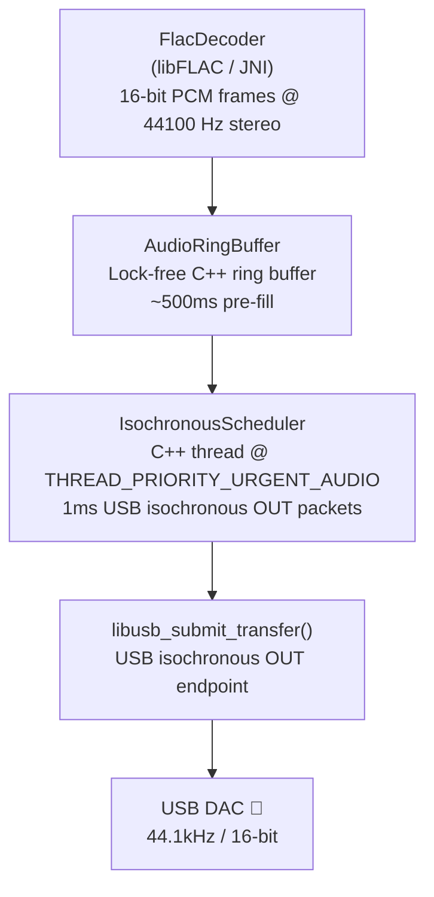

**Sample rate negotiation (UAC 1.0 SET_CUR):**

```cpp
uint8_t freq[3] = { 0x44, 0xAC, 0x00 };  // 44100 = 0x00AC44, little-endian 3-byte
libusb_control_transfer(
    handle,
    LIBUSB_REQUEST_TYPE_CLASS | LIBUSB_RECIPIENT_ENDPOINT | LIBUSB_ENDPOINT_OUT,
    0x01,           // UAC_SET_CUR
    0x0100,         // SAMPLING_FREQ_CONTROL
    endpoint_address,
    freq, 3, TIMEOUT_MS
);
```

### 7.6 DAC Detection & Capability Negotiation

A USB DAC presents as USB Audio Class (Device Class 0x01). On attach, BitPerfect inspects descriptors to confirm the Audio Streaming interface, isochronous OUT endpoint, and supported format (PCM FORMAT_TYPE_I at 44100 Hz / 16-bit). Both UAC 1.0 and UAC 2.0 are targeted.

**Isochronous sync modes (from AOSP USB audio docs):**

- **Synchronous** — fixed bytes per SOF period; sample rate derived from USB clock. Simplest.
- **Adaptive** — peripheral adapts to potentially varying host sample rate.
- **Asynchronous (implicit feedback)** — the DAC determines the sample rate; the host accommodates via a feedback endpoint (`bSynchAddress`). Theoretically superior jitter performance. Most audiophile-grade DACs are asynchronous.

BitPerfect must check `bSynchAddress` in the endpoint descriptor. If set (asynchronous DAC), the scheduler must read and honour the feedback endpoint's packet rate adjustment — a fine-grained rate correction expressed as a 10.14 fixed-point number (UAC 1.0) or 16.16 (UAC 2.0). This is in scope and should be implemented to support the majority of quality DACs.

```kotlin
data class DacCapabilities(
    val supportedRates: List<Int>,
    val maxBitDepth: Int,
    val isUac2: Boolean,
    val isoSyncType: IsoSyncType,        // SYNC, ADAPTIVE, or ASYNC
    val feedbackEndpointAddr: Int?        // non-null if isoSyncType == ASYNC
)
```

If the DAC does not list 44100 Hz in its supported rates, BitPerfect displays an **incompatibility warning** and does **not** fall back to resampling — maintaining the bit-perfect guarantee.

### 7.7 44/45 Sample Scheduling for 44.1 kHz

44100 Hz ÷ 1000 USB frames/sec = 44.1 samples per 1 ms frame. USB packets require integer sample counts, so the scheduler alternates 44-sample and 45-sample packets to maintain the correct long-run average:

```cpp
// Every 10th packet gets +1 sample: 44×9 + 45×1 = 441 = 44100/100
int samples_this_packet(int packet_index) {
    return (packet_index % 10 == 0) ? 45 : 44;
}
// Bytes per packet: 44 × 2ch × 2 bytes = 176 bytes (standard)
//                   45 × 2ch × 2 bytes = 180 bytes (every 10th)
```

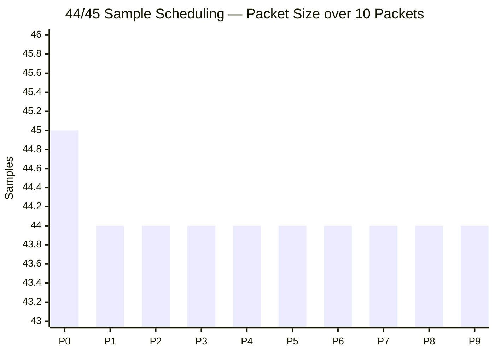

For asynchronous DACs, the feedback endpoint overrides this schedule with fine-grained rate correction.

### 7.8 Playback Pipeline & State Machine

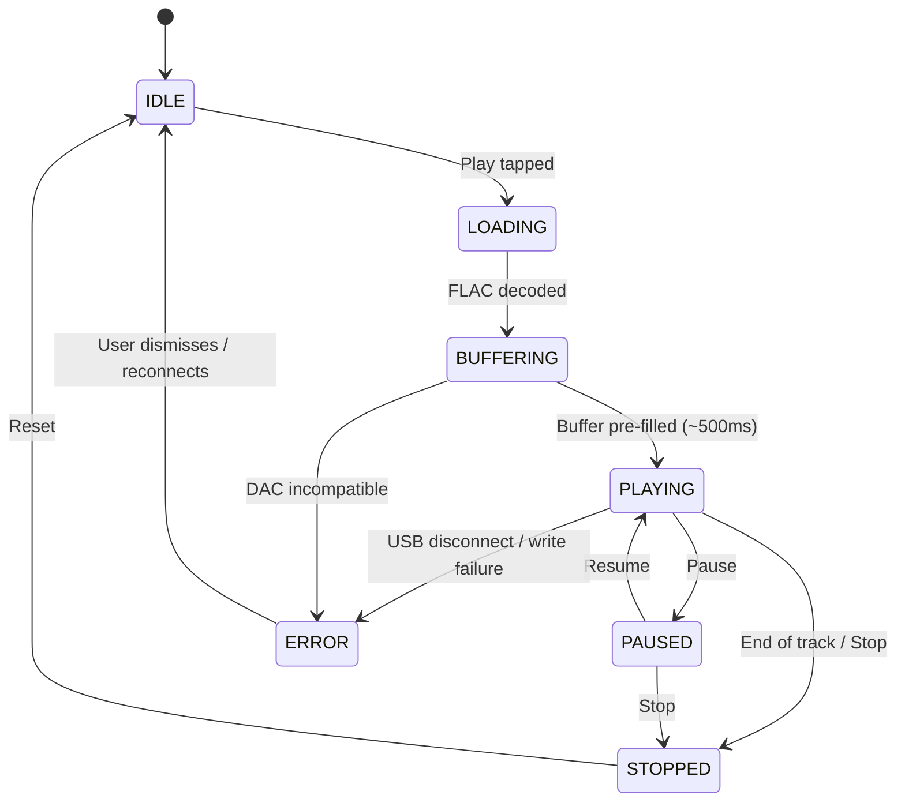

State exposed as `StateFlow<PlaybackState>` from `PlaybackUseCase`. FLAC decoder thread runs at `THREAD_PRIORITY_AUDIO`; USB write thread at `THREAD_PRIORITY_URGENT_AUDIO`.

```kotlin
interface AudioDriver {
    fun open(usbDevice: UsbDevice): Result<DacCapabilities>
    fun setSampleRate(hz: Int): Result<Unit>
    fun write(pcm: ByteArray): Result<Int>    // Returns bytes consumed
    fun drain()
    fun close()
}
```

---

## 8. Data Flow Diagrams

### Ripping Flow

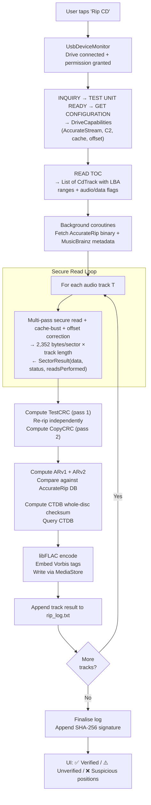

### Playback Flow (Future Phase)

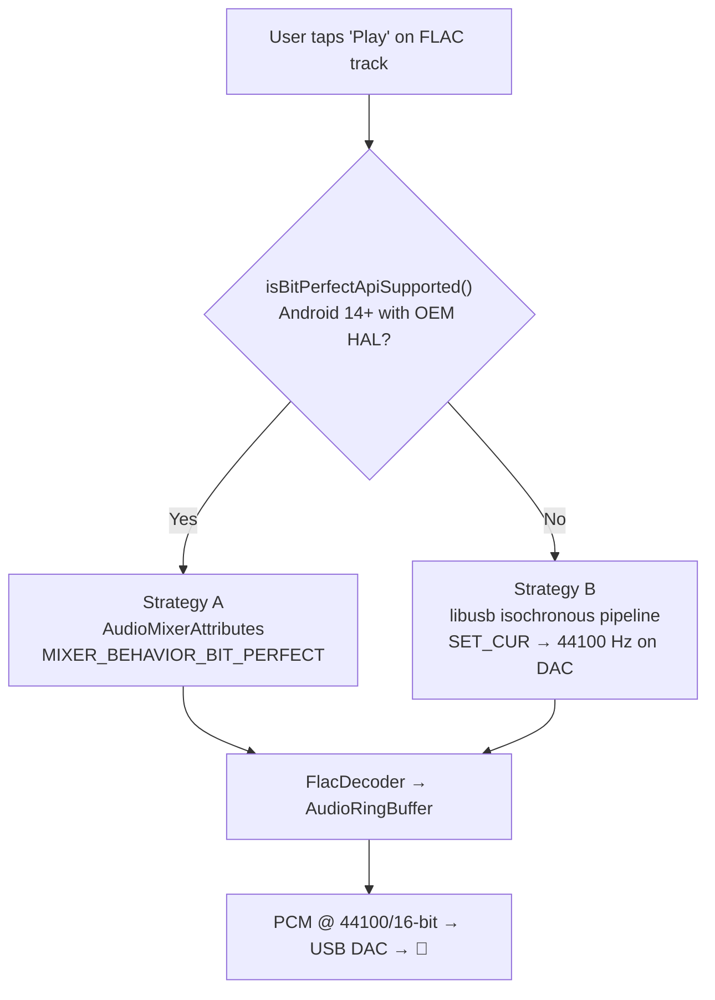

---

## 9. Key Interfaces & Kotlin APIs

### `CdDriver` (`:driver`)

```kotlin
interface CdDriver {
    fun open(usbDevice: UsbDevice): Result<Unit>
    fun getDriveCapabilities(): Result<DriveCapabilities>
    fun readToc(): Result<List<CdTrack>>
    fun readSector(lba: Int, withC2: Boolean = false): Result<ByteArray>  // 2,352 bytes
    fun readSubchannel(lba: Int): Result<ByteArray>    // 98 bytes Q subchannel
    fun setSpeed(speedKBps: Int): Result<Unit>
    fun ejectDisc(): Result<Unit>
    fun close()
}
```

### `RipUseCase` (`:core`)

```kotlin
class RipUseCase(
    private val cdDriver: CdDriver,
    private val encoder: FlacEncoder,
    private val verifier: AccurateRipVerifier,
    private val ctdb: CtdbVerifier,
    private val metadata: MetadataFetcher,
    private val logger: RipLogger,
    private val storage: MusicStorage
) {
    fun rip(disc: CdDisc, settings: RipSettings): Flow<RipProgress>
}

data class RipProgress(
    val trackNumber: Int,
    val currentLba: Int,
    val totalLba: Int,
    val qualityPct: Float,
    val suspiciousPositions: Int,
    val phase: RipPhase   // READING, TEST_CRC, COPY_CRC, VERIFYING, ENCODING
)
```

### `AccurateRipVerifier` (`:core`)

```kotlin
class AccurateRipVerifier(private val httpClient: HttpClient) {
    fun computeDiscId(tracks: List<CdTrack>): AccurateRipDiscId
    fun computeV1(pcm: ByteArray, trackNum: Int, totalTracks: Int): UInt
    fun computeV2(pcm: ByteArray, trackNum: Int, totalTracks: Int): UInt
    suspend fun query(discId: AccurateRipDiscId): List<AccurateRipPressing>
    fun verify(computed: UInt, pressings: List<AccurateRipPressing>): VerificationResult
}
```

---

## 10. Permissions & Hardware Requirements

### Android Permissions

| Permission | Purpose |
|---|---|
| USB device permission | Runtime — `UsbManager.requestPermission()` per device |
| `READ_MEDIA_AUDIO` | Reading FLAC from storage (Android 13+) |
| `WRITE_EXTERNAL_STORAGE` | Writing files (Android ≤ 9; replaced by MediaStore on Android 10+) |
| `INTERNET` | AccurateRip, CTDB, MusicBrainz HTTP queries |
| `FOREGROUND_SERVICE` | Keeping rip alive when app is backgrounded |
| `FOREGROUND_SERVICE_MEDIA_PLAYBACK` | Media playback service (Android 14+, Epic 2) |
| `WAKE_LOCK` | Prevent device sleep during long rips |

### Hardware Requirements

| Requirement | Notes |
|---|---|
| USB OTG / USB Host Mode | Available since Android 3.1 (API 12); absent on some budget devices |
| Powered USB hub | Most CD drives draw >500 mA, exceeding OTG power budget |
| USB-C OTG cable or adapter | Required for USB-C devices |
| Android 7.0+ (API 24) | Minimum per PRD |
| Android 14+ (API 34) | Recommended for Epic 2 preferred bypass path |

---

## 11. Error Handling & Edge Cases

| Scenario | Behaviour |
|---|---|
| Drive disconnected mid-rip | `ACTION_USB_DEVICE_DETACHED` caught → coroutine cancels → partial FLAC discarded → user notified |
| Sector unreadable after all batches | Flagged `SUSPICIOUS`; rip continues; MSF timecode logged; FLAC tagged `UNRECOVERED_SECTORS=N` |
| TestCRC ≠ CopyCRC | Logged "Copy not OK"; rip file preserved with warning tag; user advised disc may be damaged |
| AccurateRip server unreachable | Verification skipped; track flagged `UNVERIFIED` (not a rip error) |
| Disc not in AccurateRip DB | Same — expected for obscure pressings; T&C CRC is the local fallback |
| DAC does not support 44100 Hz | Incompatibility warning shown in UI; no resampling fallback |
| DAC disconnected mid-playback | `PlaybackUseCase` transitions to `ERROR` state; UI shows reconnect prompt |
| Drive hangs mid-read | 30s timeout → skip sector with zero-fill → log event → continue |
| Persistent mismatches on one track | Auto-reduce speed via `SET CD SPEED` (0xBB) → retry at 2× or 1× |
| Drive returns all silence | Auto-detect: fall back from `READ CD` (0xBE) to `READ(10)` (0x28) |
| Multiple USB devices connected | `UsbDeviceMonitor` classifies each independently; drive and DAC can be active simultaneously |
| Storage permission denied | Clear user-facing error on DiagnosticsScreen; no crash |

---

## 12. Testing Strategy

### Unit Tests (`:core`)

- `AccurateRipVerifierTest` — known PCM byte sequences with precomputed ARv1/v2 expected checksums (derived from `secure.md` reference implementations).
- `FreedBDiscIdTest` — known TOC → expected freedb disc ID value.
- `OffsetCorrectionTest` — PCM byte array with +/- sample offsets applied and verified.
- `RipUseCaseTest` — mock `CdDriver` returning canned sector data; verify FLAC CRC32 matches expected.
- `PlaybackStateMachineTest` — all `PlaybackState` transitions validated using Turbine for `StateFlow`.

### Integration Tests (`:driver`)

USB emulation is unavailable on standard emulators. `:driver` integration tests run on a physical device via `adb` on CI hardware:

```yaml
# .github/workflows/integration-tests.yml
- name: Run instrumented tests on USB hardware
  run: adb shell am instrument -w
       com.example.bitperfect.driver.test/androidx.test.runner.AndroidJUnitRunner
```

The suite verifies BOT protocol framing, `READ CD` command dispatch, TOC parsing, and sector data integrity.

### End-to-End Tests

A reference disc (known AccurateRip checksums, confidence > 10) is used as the golden master:

1. E2E test rips the disc on CI hardware.
2. Computed checksums are compared against the reference AR database entries.
3. `rip_log.txt` is validated for EAC format compliance and SHA-256 signature correctness via the CUETools log verifier.

For Epic 2 E2E: a USB audio loopback device captures DAC output at 44100/16; a Python script compares captured PCM byte-for-byte against the source FLAC.

### Manual QA Checklist

- [ ] DiagnosticsScreen shows correct model, C2 status, cache detection result, offset.
- [ ] Rip completes with ✅ AccurateRip verified badge on a well-known disc.
- [ ] Track quality shows 100.0% on a clean disc.
- [ ] Suspicious positions correctly identified on a scratched test disc.
- [ ] `rip_log.txt` passes CUETools log verifier (SHA-256 check passes).
- [ ] FLAC tags contain all required fields including `ACCURATERIPRESULT`.
- [ ] CUE sheet correctly represents gap positions.
- [ ] Hot-plug/unplug of CD drive handled gracefully without crash.
- [ ] App survives screen-off during rip (Foreground Service persists).
- [ ] Storage permission denied → clear error, no crash.
- [ ] *(Epic 2)* FLAC plays back at 44.1 kHz / 16-bit with no audible artefacts through USB DAC.
- [ ] *(Epic 2)* DAC sample rate indicator confirms 44.1 kHz (not 48 kHz) output.

---

## 13. Feature Parity Matrix (EAC vs BitPerfect)

| Feature | EAC | BitPerfect | Priority |
|---------|-----|-----------|----------|
| Secure Mode multi-pass majority | ✅ | ✅ | Must-have |
| Accurate Stream detection | ✅ | ✅ | Must-have |
| Cache defeat (decoy seek) | ✅ | ✅ | Must-have |
| C2 error pointer mode | ✅ optional | ✅ conditional | Should-have |
| Read offset correction | ✅ | ✅ | Must-have |
| AccurateRip auto-calibration | ✅ | ✅ | Must-have |
| Overread lead-in / lead-out | ✅ | ✅ silence fill | Should-have |
| Track synchronisation (gapless) | ✅ | ✅ | Should-have |
| Gap detection (methods A/B/C) | ✅ | ✅ | Should-have |
| AccurateRip v1 | ✅ | ✅ | Must-have |
| AccurateRip v2 | ✅ | ✅ | Must-have |
| Test & Copy CRC32 | ✅ | ✅ | Must-have |
| CUETools DB verification | ✅ plugin | ✅ | Should-have |
| FLAC output | ✅ | ✅ | Must-have |
| WAV output | ✅ | ✅ | Should-have |
| CUE sheet generation | ✅ | ✅ | Must-have |
| EAC-compatible log + SHA-256 | ✅ | ✅ | Must-have |
| MusicBrainz metadata | ✅ plugin | ✅ | Must-have |
| freedb / gnudb metadata | ✅ | ✅ | Should-have |
| Drive diagnostics dashboard | ✅ | ✅ | Must-have |
| Real-time terminal log view | ✅ | ✅ | Must-have |
| Speed reduction on errors | ✅ | ✅ | Should-have |
| Per-sector suspicious position log | ✅ | ✅ | Must-have |
| Multi-disc set support | ✅ | ✅ | Should-have |
| CD-Text reading | ✅ | ⚠️ optional | Nice-to-have |
| Hidden track detection (pre-gap) | ✅ | ⚠️ optional | Nice-to-have |
| Burst mode (fast, no verify) | ✅ | ⚠️ optional | Nice-to-have |
| Bit-perfect DAC playback | ❌ | ✅ future phase | Post-v1.0 |

---

## 14. Performance Considerations

### Read Speed vs. Accuracy

| Mode | Approx. Speed | Reliability |
|------|--------------|-------------|
| Burst (no verification) | 8–52× | Low — errors silently included |
| Secure + Accurate Stream | 2–8× | Very high |
| Secure + Cache Defeat | 1–3× | Very high (slower due to decoy seeks) |
| Secure + C2 (reliable drive only) | 4–12× | Very high (near burst on clean discs) |

### USB Throughput

USB 2.0 HS practical throughput ~35 MB/s. At 1× DAE speed raw sectors are only 176.4 KB/s — USB overhead is negligible. The bottleneck is the CD drive's DAE speed and re-read count per sector.

### Android-Specific Notes

- All USB I/O runs on a dedicated background thread; never on the main thread.
- Use `Foreground Service` with a persistent notification to prevent OS kill during long rips.
- Buffer sectors in a ring buffer (~50 sectors) to pipeline reads and FLAC encoding in parallel.
- Compute AccurateRip checksums **incrementally** as sectors arrive — not post-hoc — to avoid holding unencoded PCM in memory.
- Acquire `PARTIAL_WAKE_LOCK` for the duration of the rip session.
- Battery impact is modest: the CD drive is externally powered; the main CPU load is verification computations.

---

## Appendix A — SCSI MMC Command Reference

| Command | Opcode | Purpose |
|---------|--------|---------|
| TEST UNIT READY | 0x00 | Check if drive and disc are ready |
| REQUEST SENSE | 0x03 | Retrieve extended error info after CHECK CONDITION |
| INQUIRY | 0x12 | Get vendor ID, model, firmware revision |
| MODE SENSE(6) | 0x1A | Get drive mode parameters |
| READ SUB-CHANNEL | 0x42 | Read Q subchannel data (gap detection) |
| READ TOC/PMA/ATIP | 0x43 | Read table of contents |
| PLAY AUDIO(10) | 0x45 | Drive-assisted gap detection (alternate) |
| GET CONFIGURATION | 0x46 | Query feature support (AccurateStream, C2) |
| READ(10) | 0x28 | Alternate sector read (fallback) |
| READ CD | 0xBE | Read raw audio sectors (primary) |
| SET CD SPEED | 0xBB | Set DAE read speed |

---

## Appendix B — AccurateRip URL Format

For a disc with `disc_id_1 = 0x001C5390`, `disc_id_2 = 0x011E9241`, `disc_id_3 = 0xAD0E610D`:

Last 3 hex nibbles of `disc_id_1`: `3`, `9`, `0`

```
http://www.accuraterip.com/accuraterip/0/9/3/dAR001c5390-011e9241-ad0e610d.bin
```

---

## Appendix C — EAC-Compatible Log Format

```
BitPerfect-Android vX.Y — DD MMMM YYYY HH:MM

Used drive  : [Vendor] [Model] (firmware [Rev])

Read mode               : Secure
Utilize accurate stream : Yes
Defeat audio cache      : Yes
Make use of C2 pointers : No
Read offset correction  : +NNN

TOC of the extracted CD

     Track |   Start  |  Length  | Start sector | End sector
    ---------------------------------------------------------
        1  | 0:00.00  | 3:45.12  |         0    |   16886

Track  1

     Filename /Music/BitPerfect/Artist/Album/01 - Title.flac

     Pre-gap length                        : 0:00:00
     Peak level                            100.0 %
     Extraction speed                      3.0 X
     Track quality                        100.0 %
     Test CRC                           XXXXXXXX
     Copy CRC                           XXXXXXXX
     Accurately ripped (confidence 14)  [XXXXXXXX] (AR v2)
     CTDB                               10/10
     Copy OK

==== Log checksum (SHA-256) XXXXXXXXXXXXXXXXXXXXXXXXXXXXXXXXXXXXXXXXXXXXXXXXXXXXXXXXXXXXXXXX ====
```

---

## Appendix D — Dependency Reference

| Library | Purpose | Module |
|---------|---------|--------|
| `libusb` (NDK) | Low-level USB bulk and isochronous transfers | `:driver` |
| `libFLAC` (NDK JNI) | Lossless audio encoding and decoding | `:core`, `:driver` |
| Ktor / OkHttp | AccurateRip, CTDB, MusicBrainz HTTP queries | `:core` |
| `kotlinx.coroutines` | Async rip pipeline, `Flow`-based progress | `:core` |
| `jaudiotagger` (or custom) | FLAC Vorbis comment tag writing | `:core` |
| Koin | Dependency injection (ViewModels, services) | `:app` |
| Coil | Album art image loading | `:app` |
| Jetpack Compose + Material 3 | UI framework with Material You dynamic colour | `:app` |
| `material-color-utilities` | Monet tonal palette generation | `:app` |
| Turbine | `StateFlow` / `Flow` testing utility | `:core` tests |

---

*This document synthesises `prd.md`, `secure.md`, and `design_spec.md` from the BitPerfect repository with resolved architectural decisions. Update as implementation proceeds.*
